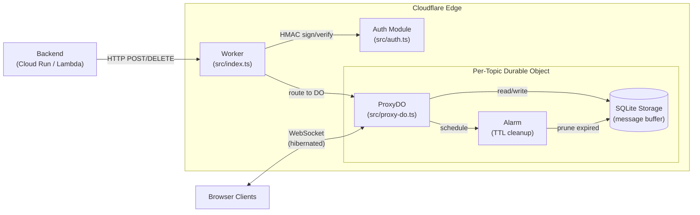
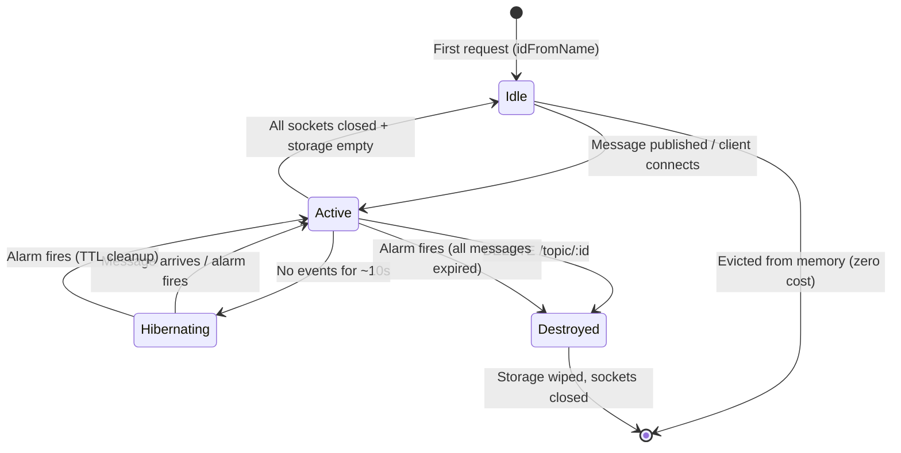

# Architecture

Detailed diagrams for cloudflare-ws-proxy.

## Request Flow

```mermaid
sequenceDiagram
    participant Backend as Backend (Cloud Run)
    participant Worker as CF Worker
    participant DO as Durable Object (ProxyDO)
    participant Client as Browser Client

    note over Backend,Worker: Backend requests use Authorization: Bearer secret

    rect rgb(40, 40, 60)
    note right of Backend: 1. Generate auth URL
    Backend->>Worker: POST /topic/:id/auth
    Worker->>Worker: Validate secret, sign HMAC token
    Worker-->>Backend: { url: "wss://…/connect?token=…" }
    end

    rect rgb(40, 60, 40)
    note right of Client: 2. Client connects
    Client->>Worker: GET /topic/:id/connect?token=… (Upgrade: websocket)
    Worker->>Worker: Verify HMAC token
    Worker->>DO: Forward upgrade request
    DO->>DO: acceptWebSocket() → hibernation mode
    DO-->>Client: Replay buffered messages
    note over DO,Client: WebSocket held open at zero cost during hibernation
    end

    rect rgb(60, 40, 40)
    note right of Backend: 3. Publish a message
    Backend->>Worker: POST /topic/:id/publish { message }
    Worker->>DO: Forward message
    DO->>DO: Buffer in storage, set TTL alarm
    DO-->>Client: ws.send(message) → broadcast to all
    note right of Backend: Backend HTTP connection closes immediately
    end

    rect rgb(60, 60, 40)
    note right of Backend: 4. Teardown (optional)
    Backend->>Worker: DELETE /topic/:id
    Worker->>DO: Force teardown
    DO->>DO: Close all sockets, deleteAll()
    end
```

## Component Diagram

## Durable Object Lifecycle

> **Topic lifecycle:** Each topic's TTL, buffer size, and generation UUID are set once on creation (first publish) and immutable for the topic's lifetime. When a topic is torn down — either by explicit `DELETE` or when all messages expire via TTL — its storage is fully wiped and connections are closed. The next publish creates a new lifecycle with a fresh generation.
