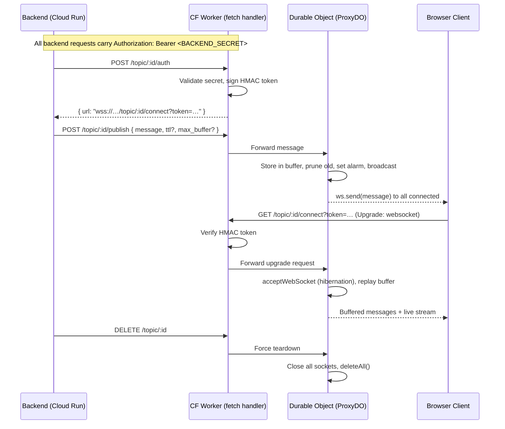

# cloudflare-ws-proxy — Implementation Plan

A deployable Cloudflare Worker template that acts as a generic serverless-to-edge WebSocket proxy. A backend (e.g. Cloud Run) publishes short-lived HTTP requests; Cloudflare holds the long-lived WebSocket connections to browsers in hibernation mode at near-zero cost.

## Architecture Overview



---

## Proposed Changes

### Project scaffolding

#### [NEW] [package.json](file:///workspaces/cloudflare-ws-proxy/package.json)
- `name`: `cloudflare-ws-proxy`
- `devDependencies`: `wrangler`, `typescript`, `@cloudflare/workers-types`, `vitest`, `@cloudflare/vitest-pool-workers`
- Scripts: `dev`, `deploy`, `types`, `test`

#### [NEW] [wrangler.jsonc](file:///workspaces/cloudflare-ws-proxy/wrangler.jsonc)
- `name`: `cloudflare-ws-proxy`
- `main`: `src/index.ts`
- `compatibility_date`: `2026-04-16`
- Durable Object binding: `PROXY_DO` → class `ProxyDO`
- Migration tag `v1` using `new_sqlite_classes: ["ProxyDO"]` (SQLite-backed storage, the modern default)
- No KV/D1 needed — the DO is self-contained

#### [NEW] [tsconfig.json](file:///workspaces/cloudflare-ws-proxy/tsconfig.json)
- Target `ES2022`, module `ESNext`, strict mode
- Types: `@cloudflare/workers-types`

#### [NEW] [.gitignore](file:///workspaces/cloudflare-ws-proxy/.gitignore)
- `node_modules/`, `.wrangler/`, `dist/`

---

### Worker entry point

#### [NEW] [src/index.ts](file:///workspaces/cloudflare-ws-proxy/src/index.ts)

The main Worker. Exports the `ProxyDO` class and a default fetch handler that acts as a router + auth gatekeeper.

**Environment bindings** (auto-generated via `wrangler types`):
```ts
interface Env {
  PROXY_DO: DurableObjectNamespace<ProxyDO>;
  BACKEND_SECRET: string;   // set via `wrangler secret put`
}
```

**Route table:**

| Method | Path | Auth | Description |
|--------|------|------|-------------|
| `POST` | `/topic/:id/auth` | Backend secret | Generate a short-lived HMAC client URL |
| `POST` | `/topic/:id/publish` | Backend secret | Publish a message to all connected clients |
| `GET` | `/topic/:id/connect?token=…&cursor=…` | HMAC token | WebSocket upgrade for browser clients |
| `DELETE` | `/topic/:id` | Backend secret | Force-close all connections and wipe storage |

**Routing implementation:**
- Parse the URL pathname with a small manual router (no framework deps)
- For backend-authenticated routes, validate `Authorization: Bearer <BACKEND_SECRET>` header
- For the connect route, verify the HMAC token from the query string
- Resolve the DO stub via `env.PROXY_DO.get(env.PROXY_DO.idFromName(topicId))` — using `idFromName` means the backend controls the topic namespace with arbitrary string IDs

---

### Token signing

#### [NEW] [src/auth.ts](file:///workspaces/cloudflare-ws-proxy/src/auth.ts)

Lightweight HMAC-SHA256 token generation and verification using the Web Crypto API (`crypto.subtle`). No external dependencies.

**Token format:** `<base64url(payload)>.<base64url(signature)>`

**Payload:**
```ts
{
  topicId: string;
  cursor?: number;      // optional: replay messages from this cursor
  exp: number;          // expiry timestamp (unix ms)
}
```

**Functions:**
- `generateToken(secret: string, topicId: string, cursor?: number, ttlSeconds?: number): Promise<string>` — default TTL 300s (5 min)
- `verifyToken(secret: string, token: string): Promise<TokenPayload | null>` — returns null if expired or signature invalid

> [!NOTE]
> Using raw HMAC rather than JWT keeps the package zero-dependency and avoids unnecessary complexity. The token is short-lived and single-purpose — it only authorizes a WebSocket connection to a specific topic.

---

### Durable Object

#### [NEW] [src/proxy-do.ts](file:///workspaces/cloudflare-ws-proxy/src/proxy-do.ts)

The core `ProxyDO` class extending `DurableObject` with WebSocket Hibernation support.

**In-memory state (reconstructed from hibernation):**
```ts
sessions: Map<WebSocket, { id: string }>  // active WS connections
```

**Persistent storage (SQLite-backed):**

Messages are stored with incrementing integer keys for cursor support:
- Key pattern: `msg:<sequence_number>` → `{ data: string, timestamp: number }`
- Metadata key: `meta` → `{ nextSeq: number, maxBufferSize: number, messageTtlMs: number }`

**Constructor:**
- Call `super(ctx, env)`
- Restore `sessions` map from `this.ctx.getWebSockets()` + `deserializeAttachment()`
- Set up auto ping/pong: `this.ctx.setWebSocketAutoResponse(new WebSocketRequestResponsePair("ping", "pong"))`

**`fetch(request)` handler — internal routing from Worker:**

The Worker forwards requests to the DO by encoding the action in the URL path:

1. **`/connect`** — WebSocket upgrade
   - Create `WebSocketPair`, call `this.ctx.acceptWebSocket(server)`
   - `serializeAttachment({ id: crypto.randomUUID() })`
   - Read `cursor` from query params; if present, replay buffered messages with `seq >= cursor`
   - Return `Response(null, { status: 101, webSocket: client })`

2. **`/publish`** — Message broadcast
   - Parse JSON body: `{ message: string, ttl?: number, max_buffer?: number }`
   - Store message in DO storage with next sequence number
   - Apply `max_buffer_size`: if buffer exceeds limit, delete oldest entries
   - Apply `message_ttl`: set alarm to `Date.now() + ttlMs` (reset on each publish)
   - Broadcast to all connected WebSockets via `this.ctx.getWebSockets().forEach(ws => ws.send(…))`
   - Return the sequence number in the response for cursor tracking

3. **`/delete`** — Force teardown
   - Close all WebSockets: `this.ctx.getWebSockets().forEach(ws => ws.close(1000, "topic deleted"))`
   - Clear all storage: `this.ctx.storage.deleteAll()`

**Message envelope sent to clients:**
```ts
{
  seq: number;         // monotonic sequence number (the cursor)
  data: string;        // the raw message payload
  timestamp: number;   // server timestamp when published
}
```

**`webSocketMessage(ws, message)`:**
- Clients are listen-only in this architecture. Any message from a client is silently ignored (or optionally echo a protocol error).

**`webSocketClose(ws, code, reason, wasClean)`:**
- Remove from `sessions` map
- Call `ws.close(code, reason)` (safe but not strictly required with compat date ≥ 2026-04-07)

**`alarm()`:**
- Sweep expired messages from storage based on `messageTtlMs`
- If messages remain with future expiry, reschedule alarm for the next expiration time
- If no messages and no connections remain, call `this.ctx.storage.deleteAll()` for full cleanup (zero-cost state)

> [!IMPORTANT]
> **Alarm mechanics:** DOs support only one alarm at a time. Setting a new alarm replaces the previous one. The publish handler always resets the alarm to `now + ttl`. The alarm handler checks each message's timestamp against the TTL and deletes expired ones, then reschedules if needed.

> [!IMPORTANT]
> **Default limits:** If no `ttl` or `max_buffer` is provided on publish, defaults will apply:
> - `max_buffer_size`: 100 messages
> - `message_ttl`: 3600000ms (1 hour)
>
> These are per-DO. They can be overridden on every publish call (latest value wins and is persisted in metadata).

---

### README

#### [NEW] [README.md](file:///workspaces/cloudflare-ws-proxy/README.md)

Comprehensive documentation covering:
- What the project does (one-paragraph overview)
- Architecture diagram
- Quick start (clone → `npm install` → `wrangler secret put BACKEND_SECRET` → `wrangler deploy`)
- Deploy button markdown for one-click Cloudflare deployment
- Full API reference for all 4 endpoints with curl examples
- Configuration reference (defaults, environment variables)
- Client-side usage example (vanilla JS `new WebSocket(url)`)
- Cost model explanation (hibernation = near-zero cost when idle)

---

## Open Questions

> [!IMPORTANT]
> **Topic ID validation:** Should topic IDs be restricted to a specific format (e.g. alphanumeric + hyphens, max 128 chars), or should any arbitrary string be accepted? `idFromName()` accepts any string, but URL-unsafe characters in the path could cause issues. I'll default to URL-safe validation and reject invalid IDs with a 400.

> [!IMPORTANT]
> **Message payload format:** The planning session describes messages as strings. Should binary (ArrayBuffer) messages also be supported via the publish endpoint? For v1 I'll keep it string-only (JSON body) for simplicity. Binary support could be added later.

> [!IMPORTANT]
> **Token TTL configuration:** The auth endpoint currently uses a hardcoded 5-minute default token TTL. Should this be configurable via an environment variable (e.g. `TOKEN_TTL_SECONDS`), or is 5 minutes always fine? I'll add it as an optional field in the auth request body.

---

## Verification Plan

### Automated Tests
- Use `vitest` + `@cloudflare/vitest-pool-workers` (Cloudflare's official test harness for Workers + DOs)
- **Unit tests for `src/auth.ts`**: token generation, verification, expiry, tampering
- **Integration tests for the Worker + DO**:
  - Publish a message → connect with cursor=0 → verify buffered replay
  - Publish N+1 messages with max_buffer=N → verify oldest is pruned
  - Generate auth token → connect → verify success
  - Use expired/invalid token → verify 401
  - DELETE topic → verify all sockets closed and storage wiped
  - Publish with TTL → wait → verify alarm cleans up

### Manual Verification
- Run `npx wrangler dev` for local development
- Use `wscat` or browser DevTools to test WebSocket connections
- Use `curl` to hit backend API endpoints
- Verify hibernation behavior by checking Cloudflare dashboard metrics after deployment
